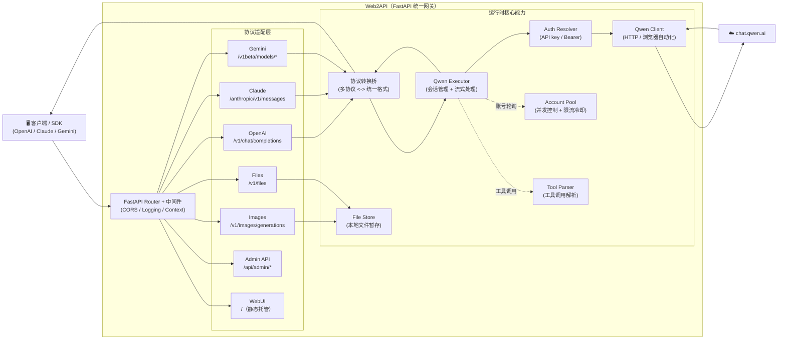

# Web2API Enterprise Gateway

[](https://github.com/YuJunZhiXue/Web2API/blob/main/LICENSE)
[](https://github.com/YuJunZhiXue/Web2API/stargazers)
[](https://github.com/YuJunZhiXue/Web2API/network/members)
[](https://github.com/YuJunZhiXue/Web2API/releases)
[](https://hub.docker.com/r/yujunzhixue/Web2API)

[](https://zeabur.com/templates/Web2API)
[](https://vercel.com/new/clone?repository-url=https%3A%2F%2Fgithub.com%2FYuJunZhiXue%2FWeb2API)

语言 / Language: [中文](./README.md) | [English](./README.en.md)

Web2API 用于将通义千问（chat.qwen.ai）网页版能力转换为 OpenAI、Anthropic Claude 与 Gemini 兼容接口。项目后端基于 FastAPI，前端基于 React + Vite，内置管理台、账号池、工具调用解析、图片生成链路与多种部署方式。

---
[](https://github.com/YuJunZhiXue/qwen2API/stargazers)
[](https://github.com/YuJunZhiXue/qwen2API/network/members)
[](https://github.com/YuJunZhiXue/qwen2API/releases)
[](https://hub.docker.com/r/yujunzhixue/web2api)

语言 / Language: [中文](./README.md)

qwen2API 将通义千问 Web 端能力转换为 OpenAI、Anthropic Claude 与 Gemini 兼容接口，并提供 Web 管理台、账号池、图片生成、文件上传与多架构 Docker 部署能力。

## 目录

- [项目说明](#项目说明)
- [核心能力](#核心能力)
- [接口支持](#接口支持)
- [模型列表与模式](#模型列表与模式)
- [图片生成](#图片生成)
- [快速开始](#快速开始)
- [环境变量说明](#环境变量说明)
- [WebUI 管理台](#webui-管理台)
- [客户端接入示例](#客户端接入示例)
- [常见问题](#常见问题)
- [故障排查速查表](#故障排查速查表)
- [开发指南](#开发指南)
- [许可证与免责声明](#许可证与免责声明)

## 项目说明

本项目定位为本地或自托管的协议兼容网关。客户端请求进入 qwen2API 后，会被统一转换为内部标准请求，再由账号池选择可用千问账号访问上游。

适合场景：

---

## 架构概览



**架构说明**：

- **后端**：Python FastAPI（`backend/`），统一处理多协议适配与上游调用
- **前端**：React 管理台（`frontend/`），运行时托管静态构建产物
- **部署**：Docker（推荐）、本地运行、Vercel、Zeabur

**核心特性**：

- **统一路由内核**：所有协议入口统一汇聚到 FastAPI Router，避免多入口行为漂移
- **协议转换桥**：Claude / Gemini 入口先转换为统一格式，再调用上游，最后转换回原协议响应
- **工具调用支持**：支持 OpenAI / Claude / Gemini 三种工具调用格式，自动解析与转换
- **账号池管理**：多账号轮询、并发控制、限流冷却、自动重试
- **文件附件**：支持文件上传、本地暂存、上下文注入
- **图片生成**：独立图片生成接口，支持多种尺寸比例

---
- 使用 OpenAI 兼容客户端访问千问 Web 能力。
- 使用 Claude Code、Codex 等客户端接入自托管网关。
- 在 WebUI 中管理账号、API Key、测试聊天与图片生成。
- 通过 Docker 在 x86_64 或 arm64 服务器上部署。

## 核心能力

- 兼容 OpenAI Chat Completions、OpenAI Responses、Anthropic Messages 与 Gemini GenerateContent 的常用调用方式。
- `/v1/models` 从上游获取模型列表，并返回模型能力、基础模型与模式变体。
- 支持按请求切换思考模式：`enable_thinking=true` 为思考模式，`enable_thinking=false` 为快速模式。
- 支持 `POST /v1/images/generations` 图片生成接口。
- 支持文件上传与上下文附件链路。
- 支持多账号轮询、单账号并发控制、限流冷却与请求重试。
- 内置 React WebUI 管理台，后端可直接托管前端构建产物。
- 提供 `/healthz` 与 `/readyz` 用于容器健康检查。

更底层的高级内部机制说明放在 [INTERNALS.md](./INTERNALS.md)。

## 接口支持

### 已支持接口

| 协议 | 路径 | 说明 |
|---|---|---|
| OpenAI Chat Completions | `POST /v1/chat/completions`、`POST /chat/completions` | 支持流式与非流式聊天请求。 |
| OpenAI Responses | `POST /v1/responses`、`POST /responses` | 面向 Responses API 的兼容入口，覆盖常用文本与流式场景。 |
| OpenAI Models | `GET /v1/models`、`GET /v1/models/{model_id}` | 返回上游模型列表、能力字段与模式变体。 |
| OpenAI Images | `POST /v1/images/generations`、`POST /images/generations` | 返回 URL 格式图片结果。 |
| OpenAI Files | `POST /v1/files`、`DELETE /v1/files/{file_id}` | 用于本项目附件链路的上传与删除。 |
| OpenAI Embeddings | `POST /v1/embeddings`、`POST /embeddings` | 兼容占位实现，返回确定性模拟向量。 |
| Anthropic Messages | `POST /anthropic/v1/messages`、`POST /v1/messages`、`POST /messages` | Claude / Anthropic SDK 常用入口。 |
| Anthropic Count Tokens | `POST /anthropic/v1/messages/count_tokens`、`POST /v1/messages/count_tokens`、`POST /messages/count_tokens` | Token 估算接口。 |
| Gemini GenerateContent | `POST /v1beta/models/{model}:generateContent`、`POST /v1/models/{model}:generateContent`、`POST /models/{model}:generateContent` | Gemini 兼容非流式入口。 |
| Gemini StreamGenerateContent | `POST /v1beta/models/{model}:streamGenerateContent`、`POST /v1/models/{model}:streamGenerateContent`、`POST /models/{model}:streamGenerateContent` | Gemini 兼容流式入口。 |
| Admin API | `/api/admin/*` | WebUI 管理接口。 |
| Health | `GET /healthz` | 存活探针。 |
| Ready | `GET /readyz` | 就绪探针。 |

### 未实现或非完整协议

| 协议 | 当前状态 |
|---|---|
| OpenAI Assistants / Threads / Runs | 不提供完整协议实现。需要此类状态机的客户端建议改走 Chat Completions、Responses 或 Anthropic Messages。 |
| OpenAI Realtime / Audio / Speech / Transcriptions | 不支持。 |
| OpenAI Batch / Fine-tuning / Vector Stores | 不支持。 |
| OpenAI Files 完整生态 | 仅实现本项目附件所需的上传与删除，不等价于 OpenAI 官方文件生命周期。 |
| OpenAI Images 全参数 | 仅覆盖文本生图、数量、尺寸/比例与 URL 返回，不保证兼容全部高级参数。 |
| 原生 Embeddings | 千问 Web 端没有原生 Embeddings；当前接口为兼容占位的模拟向量。 |

## 模型列表与模式

`/v1/models` 会优先从千问上游 `/api/models` 获取真实模型列表，再按模型能力展开模式变体。公开文档不再维护静态模型转换表，客户端应以接口返回为准。

每个模型项包含 OpenAI 兼容字段和扩展字段：

```json
{
  "id": "qwen3.6-plus",
  "object": "model",
  "created": 1700000000,
  "owned_by": "qwen",
  "capabilities": {
    "thinking": true,
    "search": true,
    "vision": true,
    "deep_research": false,
    "image_gen": true,
    "video_gen": false,
    "web_dev": false,
    "slides": false
  },
  "base_model": "qwen3.6-plus",
  "mode": "chat",
  "display_name": "qwen3.6-plus",
  "family": "qwen3.6"
}
```

支持的模式变体：

| 后缀 | 含义 |
|---|---|
| `-thinking` | 使用同一个基础模型，并强制开启思考模式。 |
| `-deep-research` | 使用深度研究模式，并默认开启搜索。 |
| `-image` | 使用图片模式。 |
| `-video` | 使用视频模式。 |
| `-webdev` | 使用网页/建站模式。 |
| `-slides` | 使用 PPT/幻灯片模式。 |

示例：

```bash
curl http://127.0.0.1:7860/v1/models \
  -H "Authorization: Bearer YOUR_API_KEY"
```

如果上游模型列表暂时不可用，服务会回退到内置兼容列表，保证常见客户端仍能完成模型发现。

### 思考与快速模式

Chat 请求可以显式传入：

```json
{
  "model": "qwen3.6-plus",
  "messages": [{"role": "user", "content": "你好"}],
  "enable_thinking": false
}
```

规则：

- `enable_thinking=true`：开启思考模式。
- `enable_thinking=false`：关闭思考模式，优先更快返回。
- 不传 `enable_thinking` 时，默认保持项目原有行为：开启思考。
- 选择 `*-thinking` 模型变体时，后端会强制开启思考，即使请求里传了 `enable_thinking=false`。
- 图片、视频等非文本模式会自动关闭思考。

## 图片生成

图片接口兼容 OpenAI Images 的常用调用方式。

- 接口：`POST /v1/images/generations`
- 默认模型：`qwen3.6-plus`
- 默认尺寸：`1328x1328`
- 默认比例：`1:1`
- 返回格式：URL

建议请求里直接使用 `qwen3.6-plus`，或省略 `model` 使用默认模型。

```bash
curl http://127.0.0.1:7860/v1/images/generations \
  -H "Content-Type: application/json" \
  -H "Authorization: Bearer YOUR_API_KEY" \
  -d '{
    "model": "qwen3.6-plus",
    "prompt": "一只赛博朋克风格的猫，霓虹灯背景，超写实",
    "n": 1,
    "size": "1328x1328",
    "response_format": "url"
  }'
```

支持尺寸与比例：

| size | ratio |
|---|---|
| `1328x1328` | `1:1` |
| `1664x928` | `16:9` |
| `928x1664` | `9:16` |
| `1472x1140` | `4:3` |
| `1140x1472` | `3:4` |

也可以传 `ratio` 或 `aspect_ratio`，例如：

```json
{
  "prompt": "一张产品海报",
  "ratio": "16:9"
}
```

## 快速开始

### 部署前准备

你需要准备：

- 一个可用的千问 Web 账号。
- 一个服务器或本机 Docker 环境。
- 一个管理台密钥 `ADMIN_KEY`。
- 一个客户端调用用的 API Key，启动后可在 WebUI 中创建。

默认访问地址：

- WebUI：`http://127.0.0.1:7860/`
- API：`http://127.0.0.1:7860/v1`
- 健康检查：`http://127.0.0.1:7860/healthz`

### 方案 A：直接拉取多架构 Docker 镜像部署（推荐）

本仓库已经通过 GitHub Actions 构建并发布 `linux/amd64` 与 `linux/arm64` 多架构镜像。服务器不需要本地构建镜像，也不需要自行构建前端。

#### 1. 创建部署目录

```bash
mkdir Web2API && cd Web2API
mkdir -p data logs
```

#### 2. 创建 `.env`

```env
ADMIN_KEY=change-me-now
PORT=7860
WORKERS=1
LOG_LEVEL=INFO
MAX_INFLIGHT_PER_ACCOUNT=2
MAX_RETRIES=3
ACCOUNT_MIN_INTERVAL_MS=0
REQUEST_JITTER_MIN_MS=0
REQUEST_JITTER_MAX_MS=0
RATE_LIMIT_BASE_COOLDOWN=600
RATE_LIMIT_MAX_COOLDOWN=3600
ACCOUNTS_FILE=/workspace/data/accounts.json
USERS_FILE=/workspace/data/users.json
CAPTURES_FILE=/workspace/data/captures.json
CONTEXT_GENERATED_DIR=/workspace/data/context_files
CONTEXT_CACHE_FILE=/workspace/data/context_cache.json
UPLOADED_FILES_FILE=/workspace/data/uploaded_files.json
CONTEXT_AFFINITY_FILE=/workspace/data/session_affinity.json
CONTEXT_INLINE_MAX_CHARS=4000
CONTEXT_FORCE_FILE_MAX_CHARS=10000
CONTEXT_ATTACHMENT_TTL_SECONDS=1800
CONTEXT_UPLOAD_PARSE_TIMEOUT_SECONDS=60
```

`ADMIN_KEY` 必须改成自己的强密码。

#### 3. 创建 `docker-compose.yml`

```yaml
services:
  Web2API:
    image: yujunzhixue/Web2API:latest
    container_name: Web2API
    restart: unless-stopped
    init: true
    env_file:
      - path: .env
        required: false
    ports:
      - "${HOST_PORT:-7860}:7860"
    volumes:
      - ./data:/workspace/data
      - ./logs:/workspace/logs
    shm_size: "512m"
    environment:
      PYTHONIOENCODING: utf-8
      PORT: "7860"
      WORKERS: "1"
      LOG_LEVEL: "INFO"
      BROWSER_POOL_SIZE: "1"
      MAX_INFLIGHT_PER_ACCOUNT: "2"
      ACCOUNT_MIN_INTERVAL_MS: "0"
      REQUEST_JITTER_MIN_MS: "0"
      REQUEST_JITTER_MAX_MS: "0"
    healthcheck:
      test: ["CMD-SHELL", "curl -fsS http://127.0.0.1:7860/healthz || exit 1"]
      interval: 30s
      timeout: 10s
      start_period: 120s
      retries: 3
```

#### 第三步：创建 `.env`（可选但推荐）

建议至少写入以下内容：

```env
# ========== 必须修改 ==========
ADMIN_KEY=change-me-now              # 管理台登录密钥，必须修改为强密码！

# ========== 基础配置 ==========
PORT=7860                            # 服务监听端口
WORKERS=1                            # Uvicorn worker 数量，必须保持 1（多 worker 会导致 JSON 文件冲突）
LOG_LEVEL=INFO                       # 日志级别：DEBUG/INFO/WARNING/ERROR

# ========== 并发控制 ==========
MAX_INFLIGHT=1                       # 每账号最大并发请求数（账号多时可改为 2）
MAX_RETRIES=3                        # 请求失败最大重试次数（网络不稳定时增加到 5）

# ========== 限流冷却 ==========
ACCOUNT_MIN_INTERVAL_MS=1200         # 同账号两次请求最小间隔（毫秒），被限流时启用
REQUEST_JITTER_MIN_MS=120            # 请求前随机抖动最小值（毫秒）
REQUEST_JITTER_MAX_MS=360            # 请求前随机抖动最大值（毫秒）
RATE_LIMIT_BASE_COOLDOWN=600         # 限流基础冷却时间（秒），频繁限流时增加到 1200
RATE_LIMIT_MAX_COOLDOWN=3600         # 限流最大冷却时间（秒）

# ========== 数据文件路径（Docker 部署通常不需要改）==========
ACCOUNTS_FILE=/workspace/data/accounts.json
USERS_FILE=/workspace/data/users.json
CONTEXT_CACHE_FILE=/workspace/data/context_cache.json
UPLOADED_FILES_FILE=/workspace/data/uploaded_files.json
```

**环境变量详细说明**：

| 变量 | 默认值 | 说明 | 何时修改 |
|------|--------|------|----------|
| `ADMIN_KEY` | `admin` | 管理台登录密钥 | **必须修改**为强密码 |
| `PORT` | `7860` | 服务监听端口 | 端口冲突时修改 |
| `WORKERS` | `1` | Uvicorn worker 数量 | **必须保持 1**，多 worker 会导致数据冲突 |
| `LOG_LEVEL` | `INFO` | 日志级别 | 调试时改为 `DEBUG`，生产环境改为 `WARNING` |
| `MAX_INFLIGHT` | `1` | 每账号最大并发数 | 账号多且稳定时可改为 `2` |
| `MAX_RETRIES` | `3` | 请求失败重试次数 | 网络不稳定时增加到 `5` |
| `ACCOUNT_MIN_INTERVAL_MS` | `0` | 同账号请求间隔（毫秒） | 被限流时改为 `1200` |
| `REQUEST_JITTER_MIN_MS` | `0` | 请求抖动最小值 | 模拟真实用户行为时设置 `120` |
| `REQUEST_JITTER_MAX_MS` | `0` | 请求抖动最大值 | 模拟真实用户行为时设置 `360` |
| `RATE_LIMIT_BASE_COOLDOWN` | `600` | 限流冷却时间（秒） | 频繁限流时增加到 `1200` |

**docker-compose.yml 配置说明**：

| 配置项 | 说明 | 建议修改 |
|--------|------|----------|
| `image` | 预构建镜像地址，支持 amd64/arm64 | 保持默认 `yujunzhixue/Web2API:latest` |
| `ports` | 端口映射，格式：`宿主机端口:容器端口` | 如 7860 被占用，改为 `"8080:7860"` |
| `volumes` | 数据持久化挂载 | **必须保留**，否则重启后数据丢失 |
| `shm_size` | 浏览器共享内存 | 浏览器崩溃时改为 `"512m"` |
| `environment.PORT` | 容器内服务端口 | 通常不需要改 |
| `healthcheck` | 健康检查配置 | 保持默认即可 |

#### 4. 拉取并启动

```bash
docker compose pull
docker compose up -d
```

#### 5. 查看状态

```bash
docker compose ps
docker compose logs -f
curl http://127.0.0.1:7860/healthz
```

#### 6. 初始化账号与 API Key

打开 `http://服务器IP:7860/`，使用 `.env` 里的 `ADMIN_KEY` 登录管理台。

建议初始化顺序：

1. 在账号管理中添加或注册千问账号。
2. 确认账号状态可用。
3. 在 API Key 管理中创建客户端调用用的 API Key。
4. 在聊天测试页调用一次普通文本请求。
5. 如需图片生成，在图片页面测试一次生图。

#### 7. 更新镜像

```bash
docker compose pull
docker compose up -d
```

---

## 跨平台（amd64/arm64）部署说明

你在 Mac（Apple Silicon, arm64）上 `docker build` 默认会产出 `linux/arm64` 镜像；
如果把这个单架构镜像推到仓库，Linux x86_64 服务器（`linux/amd64`）拉取后会报：

`The requested image's platform (linux/arm64/v8) does not match the detected host platform (linux/amd64/...)`

正确做法是发布 **多架构镜像（manifest list）**，同时包含 `linux/amd64` 与 `linux/arm64`。

### 方案 A：用 GitHub Actions 自动发布多架构镜像（推荐）

本仓库已在 [docker-publish.yml](file:///Users/hongyan/work/workspace/todo/ai/Web2API/.github/workflows/docker-publish.yml) 配置 `platforms: linux/amd64,linux/arm64`。
你只需要把修复推到你自己的仓库并设置 DockerHub secrets，然后在服务器端执行：
#### 8. 停止服务

```bash
docker compose down
```

如果要保留账号、API Key、上传文件和缓存数据，不要删除 `data/`。

### 方案 B：本地 buildx 推送多架构镜像

适合没有 CI、需要推送到自己镜像仓库的场景。此方案会在本地构建 `linux/amd64` 与 `linux/arm64` 镜像，并直接推送到镜像仓库。

#### 1. 登录镜像仓库

```bash
docker login

# 2) 构建并推送多架构镜像
./scripts/buildx-push.sh <你的仓库名>/Web2API:<tag>
```

如果使用 GHCR 或私有仓库，请按对应仓库要求登录。

#### 2. 创建并启用 buildx builder

```bash
docker buildx create --name web2api-builder --use
docker buildx inspect --bootstrap
```

- `docker-compose.yml`：默认 `image: yujunzhixue/Web2API:latest`（或通过 `Web2API_IMAGE` 覆盖）
- `docker-compose.build.yml`：仅用于本地从源码构建（开发/调试）


#### 3. 构建并推送多架构镜像

把 `YOUR_DOCKERHUB_NAME` 和 `v0.0.0` 改成自己的仓库名与版本号。

```bash
docker buildx build \
  --platform linux/amd64,linux/arm64 \
  -t YOUR_DOCKERHUB_NAME/web2api:v0.0.0 \
  -t YOUR_DOCKERHUB_NAME/web2api:latest \
  --push \
  .
```

PowerShell 可以写成：

```powershell
docker buildx build `
  --platform linux/amd64,linux/arm64 `
  -t YOUR_DOCKERHUB_NAME/web2api:v0.0.0 `
  -t YOUR_DOCKERHUB_NAME/web2api:latest `
  --push `
  .
```

#### 4. 服务器使用自定义镜像

方式一：修改 `docker-compose.yml` 的 `image`。

```yaml
image: YOUR_DOCKERHUB_NAME/web2api:latest
```

方式二：保留仓库默认 Compose 文件，通过 `.env` 或命令行覆盖镜像。

```env
QWEN2API_IMAGE=YOUR_DOCKERHUB_NAME/web2api:latest
```

然后在服务器执行：

```bash
docker compose pull
docker compose up -d
```

### 方案 C：本地源码开发运行

适合开发、调试和改前端页面，不建议作为生产部署方式。

环境要求：

- Python 3.10+
- Node.js 20+
- 可访问 Python 与 npm 依赖源
- 可访问 Camoufox 浏览器内核下载源

一键开发启动：

```bash
git clone https://github.com/YuJunZhiXue/Web2API.git
cd Web2API
python start.py
```

`start.py` 会安装后端依赖、检查 Camoufox、启动后端，并启动前端 Vite 开发服务器。

如果需要手动分开启动，见 [开发指南](#开发指南)。

## 环境变量说明

项目提供 `.env.example`，部署时建议复制为 `.env` 后修改。

| 变量 | 推荐值 / 默认值 | 说明 |
|---|---|---|
| `ADMIN_KEY` | `change-me-now` | 管理台登录密钥，生产环境必须修改。 |
| `PORT` | `7860` | 容器内服务端口。Compose 默认映射到宿主机 `7860`。 |
| `HOST_PORT` | `7860` | 仅 Compose 使用，控制宿主机端口映射。 |
| `QWEN2API_IMAGE` | `yujunzhixue/web2api:latest` | 仅 Compose 使用，覆盖要拉取的镜像。 |
| `WORKERS` | `1` | Uvicorn worker 数量。建议保持 `1`，避免 JSON 数据文件并发写冲突。 |
| `LOG_LEVEL` | `INFO` | 日志级别，可选 `DEBUG`、`INFO`、`WARNING`、`ERROR`。 |
| `BROWSER_POOL_SIZE` | `1` | 浏览器页面池大小。内存有限时保持 `1`。 |
| `MAX_INFLIGHT_PER_ACCOUNT` | `2` | 每个千问账号允许同时处理的请求数。 |
| `MAX_RETRIES` | `3` | 上游失败后的最大重试次数。 |
| `ACCOUNT_MIN_INTERVAL_MS` | `0` | 同一账号两次请求之间的最小间隔。 |
| `REQUEST_JITTER_MIN_MS` | `0` | 请求前随机抖动最小值，单位毫秒。 |
| `REQUEST_JITTER_MAX_MS` | `0` | 请求前随机抖动最大值，单位毫秒。 |
| `RATE_LIMIT_BASE_COOLDOWN` | `600` | 账号限流后的基础冷却秒数。 |
| `RATE_LIMIT_MAX_COOLDOWN` | `3600` | 账号限流后的最大冷却秒数。 |
| `ACCOUNTS_FILE` | `/workspace/data/accounts.json` | 千问账号数据文件路径。 |
| `USERS_FILE` | `/workspace/data/users.json` | API Key / 用户数据文件路径。 |
| `CAPTURES_FILE` | `/workspace/data/captures.json` | 调试抓取数据文件路径。 |
| `CONTEXT_GENERATED_DIR` | `/workspace/data/context_files` | 上下文附件与生成文件目录。 |
| `CONTEXT_CACHE_FILE` | `/workspace/data/context_cache.json` | 上下文缓存数据文件。 |
| `UPLOADED_FILES_FILE` | `/workspace/data/uploaded_files.json` | 上传文件元数据文件。 |
| `CONTEXT_AFFINITY_FILE` | `/workspace/data/session_affinity.json` | 会话亲和数据文件。 |
| `CONTEXT_INLINE_MAX_CHARS` | `4000` | 小文件内联进上下文的字符上限。 |
| `CONTEXT_FORCE_FILE_MAX_CHARS` | `10000` | 强制转附件前允许处理的字符上限。 |
| `CONTEXT_ATTACHMENT_TTL_SECONDS` | `1800` | 附件缓存过期时间。 |
| `CONTEXT_UPLOAD_PARSE_TIMEOUT_SECONDS` | `60` | 上传文件解析超时时间。 |

兼容说明：

## docker-compose.yml 说明

以下是推荐的 Compose 配置：

```yaml
services:
  Web2API:
    image: yujunzhixue/Web2API:latest
    container_name: Web2API
    restart: unless-stopped
    env_file:
      - path: .env
        required: false
    ports:
      - "7860:7860"
    volumes:
      - ./data:/workspace/data
      - ./logs:/workspace/logs
    shm_size: '256m'
    environment:
      PYTHONIOENCODING: utf-8
      PORT: "7860"
      ENGINE_MODE: "hybrid"
    healthcheck:
      test: ["CMD", "curl", "-f", "http://localhost:7860/healthz"]
      interval: 30s
      timeout: 10s
      start_period: 120s
      retries: 3
```

### 字段说明

| 字段 | 说明 |
|---|---|
| `image` | 预构建镜像地址。普通部署推荐使用。 |
| `container_name` | 容器名称。 |
| `restart` | 开机或故障时自动重启。 |
| `env_file` | 从 `.env` 加载环境变量。 |
| `ports` | 将宿主机端口映射到容器端口。 |
| `volumes` | 持久化数据与日志目录。 |
| `shm_size` | 浏览器共享内存。Camoufox / Firefox 运行建议至少 256m。 |
| `environment` | Compose 中直接写入的环境变量，优先级高于镜像默认值。 |
| `healthcheck` | 容器健康检查。 |

### 用户需要修改的部分

通常只需要根据部署环境修改以下内容：

1. **端口映射**
   ```yaml
   ports:
     - "7860:7860"
   ```
   如果服务器 7860 已占用，可以改为：
   ```yaml
   ports:
     - "8080:7860"
   ```

2. **引擎模式**
   ```yaml
   environment:
     ENGINE_MODE: "hybrid"
   ```
   可改为：
   ```yaml
   environment:
     ENGINE_MODE: "httpx"
   ```

3. **共享内存**
   ```yaml
   shm_size: '256m'
   ```
   如果浏览器容易崩溃，可改为：
   ```yaml
   shm_size: '512m'
   ```

4. **数据挂载目录**
   ```yaml
   volumes:
     - ./data:/workspace/data
     - ./logs:/workspace/logs
   ```
   如需自定义存储路径，可替换左侧宿主机目录。

---

## 端口说明

### 为什么 Docker 部署前后端在同一个端口

Docker 镜像中已经构建好前端静态文件，并由后端统一托管：

- 后端 API：`http://host:7860/*`
- 前端管理台：`http://host:7860/`

因此 **Docker 部署时默认只有一个端口 7860**。

### 为什么本地开发时可能不是同一个端口

本地开发通常有两种方式：

1. **使用 `python start.py`**  
   前端会先构建为静态文件，再由后端统一托管。此时通常仍是一个端口。

2. **使用前端 Vite 开发服务器单独运行**  
   例如：
   - 前端：`http://localhost:5173`
   - 后端：`http://localhost:7860`

这种模式仅用于前端开发调试，不是生产部署模式。

---
- `MAX_INFLIGHT` 是旧版兼容别名，不建议继续使用。

## WebUI 管理台

访问 `http://127.0.0.1:7860/`，使用 `ADMIN_KEY` 登录。

主要页面：

- 账号管理：添加、注册、激活、验证和删除千问账号。
- API Key 管理：创建和删除客户端调用用的 Key。
- 聊天测试：选择模型、切换思考/快速模式、测试流式与非流式请求。
- 图片生成：测试图片生成接口和尺寸比例。
- 系统设置：查看运行状态与基础配置。

数据持久化依赖 `data/` 目录。Docker 部署时必须保留：

```yaml
volumes:
  - ./data:/workspace/data
  - ./logs:/workspace/logs
```

主要页面包括：

| 页面 | 说明 |
|---|---|
| 运行状态 | 查看整体服务状态、引擎状态与统计信息 |
| 账号管理 | 添加、测试、禁用、查看上游账号状态 |
| API Key | 管理下游调用密钥 |
| 接口测试 | 直接测试 OpenAI 对话接口 |
| 图片生成 | 图形化图片生成页面 |
| 系统设置 | 查看并修改部分运行时参数 |

---

## 数据持久化

默认数据目录：

- `data/accounts.json`：上游账号信息
- `data/users.json`：下游 API Key / 用户数据
- `data/captures.json`：抓取结果
- `data/config.json`：运行时配置
- `logs/`：运行日志

生产环境请务必持久化 `data/` 与 `logs/`。

---

## 项目目录结构

```text
Web2API/
├── backend/                        # Python FastAPI 后端
│   ├── main.py                     # 应用入口，注册路由 / 中间件 / 生命周期
│   ├── api/                        # 协议入口层
│   │   ├── chat.py                 # OpenAI Chat Completions
│   │   ├── anthropic.py            # Anthropic Messages
│   │   ├── gemini.py               # Gemini GenerateContent
│   │   ├── images.py               # 图片生成
│   │   ├── files.py                # 文件上传 / 管理
│   │   ├── admin.py                # 管理 API
│   │   └── models.py               # 模型别名
│   ├── adapter/
│   │   ├── cli_proxy.py            # 多协议 → StandardRequest 转换代理
│   │   └── standard_request.py     # 统一请求结构 + 客户端 profile
│   ├── core/
│   │   ├── config.py               # 全局配置 / 模型映射
│   │   ├── request_logging.py      # 请求上下文 + 链路日志
│   │   ├── auth.py                 # API Key / Bearer 鉴权
│   │   └── account_pool/           # 账号池（已拆分为子模块）
│   │       ├── pool_core.py        # 池状态 / 冷却 / 淘汰
│   │       └── pool_acquire.py     # 账号获取 / 并发控制
│   ├── runtime/
│   │   ├── execution.py            # 流式执行 + 重试指令
│   │   └── stream_metrics.py       # 流式指标埋点
│   ├── services/                   # 稳定性 / 格式转换 / 兼容层
│   │   ├── qwen_client.py          # HTTP + 浏览器双引擎
│   │   ├── prompt_builder.py       # 消息 → prompt + tools 装配
│   │   ├── tool_parser.py          # ##TOOL_CALL## 文本协议解析
│   │   ├── tool_validator.py       # 工具入参校验
│   │   ├── tool_arg_fixer.py       # 智能引号 / 模糊 Edit 修复
│   │   ├── tool_few_shot.py        # 按命名空间注入少样本
│   │   ├── tool_name_obfuscation.py# 工具名混淆避免 Qwen 函数校验
│   │   ├── schema_compressor.py    # JSON Schema → TS-like 签名
│   │   ├── chat_id_pool.py         # chat_id 预热池
│   │   ├── file_content_cache.py   # Read 结果缓存
│   │   ├── incremental_text_streamer.py # 流式 warmup / guard
│   │   ├── refusal_cleaner.py      # 历史拒绝文本清洗
│   │   ├── topic_isolation.py      # 新任务检测 / 历史切分
│   │   ├── truncation_recovery.py  # ##TOOL_CALL## 截断续写
│   │   ├── openai_stream_translator.py # 文本协议 → OpenAI SSE
│   │   ├── context_attachment_manager.py # 长上下文 → 附件
│   │   ├── context_offload.py      # 上下文卸载策略
│   │   ├── context_cleanup.py      # TTL 清理
│   │   ├── auth_resolver.py        # API Key → 上游账号
│   │   ├── auth_quota.py           # 下游 Key 配额
│   │   ├── completion_bridge.py    # 多协议响应桥
│   │   ├── file_store.py           # 本地文件暂存
│   │   ├── upstream_file_uploader.py # 文件上传至千问
│   │   ├── garbage_collector.py    # 会话 / 临时文件 GC
│   │   ├── response_formatters.py  # 各协议响应格式化
│   │   ├── standard_request_builder.py
│   │   ├── attachment_preprocessor.py
│   │   ├── task_session.py
│   │   └── token_calc.py
│   ├── toolcall/
│   │   ├── normalize.py            # 工具名规范化
│   │   ├── stream_state.py         # 流式工具调用状态机
│   │   └── formats_json.py         # JSON 工具格式
│   ├── upstream/
│   │   └── qwen_executor.py        # 会话生命周期 + 流式分发
│   └── data/                       # 运行期可写目录（accounts/users/config/...）
├── frontend/                       # React + Vite 管理台
│   ├── src/
│   │   ├── pages/                  # Dashboard / Settings / Test / Images
│   │   ├── layouts/
│   │   └── components/
│   └── vite.config.ts
├── docker-compose.yml
├── Dockerfile
├── start.py                        # 一键启动（装依赖 + 下浏览器 + 构建前端）
├── requirements.txt
├── .env.example
└── README.md
```

---

## 高级特性与内部机制

以下是 Web2API 为了在"千问网页对话"这条弱约束上游上跑稳定工具调用而引入的内部模块。普通使用者可以忽略；希望深度定制或贡献代码时可参考。

### Chat ID 预热池（`chat_id_pool.py`）

- **动机**：`/api/v2/chats/new` 握手耗时在健康时 500ms，抖动时可达 5~6s。
- **做法**：服务启动后为每个可用账号预建 `target_per_account` 个 `chat_id`，请求到来直接 pop；用掉一个后台立即补位。
- **TTL**：单条 `chat_id` 默认 30 分钟过期，过期则丢弃重建。
- **兜底**：取不到预热 chat_id 时 fallback 到同步 `create_chat`。

### Schema 压缩（`schema_compressor.py`）

把 JSON Schema 压缩成 TS-like 签名：

```
输入：{"type":"object","properties":{
         "file_path":{"type":"string"},
         "encoding":{"type":"string","enum":["utf-8","base64"]}},
       "required":["file_path"]}

输出：{file_path!: string, encoding?: utf-8|base64}
```

- 单工具定义从 ~1.5KB 降到 ~150~250 bytes。90 个工具 ~135KB → ~15KB。
- 输入越小，上游输出预算越多，截断率越低。

### 工具名混淆（`tool_name_obfuscation.py`）

Qwen 上游会把常见短名（Read/Write/Bash/Edit…）当内置函数校验并返回"Tool X does not exists."。

- **显式别名**：`Read→fs_open_file`、`Bash→shell_run`、`Grep→text_search` 等。
- **通用兜底**：其余客户端工具自动加 `u_` 前缀，如 `TaskCreate→u_TaskCreate`、`mcp__playwright__click→u_mcp__playwright__click`。
- 出站（发往 Qwen）自动转换；入站（Qwen 返回）反向还原给客户端。

### 工具调用少样本（`tool_few_shot.py`）

- **问题**：有 90+ 工具（含 MCP / Skills / Plugin 多命名空间）时，Qwen 倾向于只调用几个"熟悉"的核心工具，MCP / Skill 几乎不被主动使用。
- **做法**：按命名空间分组挑一个代表工具，构造一条合成的 `[user → assistant]` 对话，assistant 示范**多种类型工具同时被调用**（1 个核心 + 最多 4 个第三方代表）。
- **效果**：模型看到"assistant 在第一步就用了 5 种不同类型的工具"，会复现这种多样性。

### 工具调用截断续写（`truncation_recovery.py`）

- 检测：`##TOOL_CALL##` 开标签数 > `##END_CALL##` 闭标签数 → 说明某个 action block 尚未闭合。
- 续写：丢弃全部工具定义和历史（省 token），只保留末尾 2000 字节作为 anchor，在 assistant 角色塞入 anchor + user "请从中断点继续，不要重复"。
- 去重：`deduplicateContinuation` 去掉与已有末尾的重叠；最多续写 `MAX_AUTO_CONTINUE` 次。

### 文件内容缓存（`file_content_cache.py`）

Claude Code 客户端对同一文件重复 Read 时，不重发完整内容，只发一句 "File unchanged since last read" 提示语。但 Web2API 每次请求都新建 Qwen chat，Qwen 完全没历史，提示语毫无意义。

- 在代理侧按 `(api_key, file_path)` 保留最近一次真实 Read 结果
- 检测到提示语时用缓存回填
- 内存 LRU，最多 200 条，每条 TTL 15 分钟，按 API KEY 做 session 隔离

### 历史拒绝清洗（`refusal_cleaner.py`）

扫描过往 assistant 消息里的拒绝 / 自我限制文本（"I'm sorry, I cannot help..."、"我只能回答编程相关问题"、"Tool X does not exist"），命中后把整条消息内容替换为占位工具调用，防止模型看到自己的拒绝模式并级联复现。

### 增量流式 warmup（`incremental_text_streamer.py`）

- **warmup**：累积 96 字符再开始输出。期间可做拒绝检测 / 格式判断。
- **guard**：任何时候输出到客户端时都保留末尾 256 字符暂不输出，给跨 chunk 检测留空间（例如识别 `##TOOL_CALL##` 开始标记）。
- **finish()**：结束时把剩余全部补齐。

### 话题隔离（`topic_isolation.py`）

- 抽取每条 user 消息的**关键实体**：文件路径、URL、专名 / 引号字符串 / 驼峰标识符。
- 计算最新 user 消息实体集 vs 历史 first user 实体集的 **Jaccard 相似度**。
- 当最新 user 有自己的非空实体集且 Jaccard < 0.1 → 判定为新任务 → 调用方丢弃历史。
- 避免用户从"读文件"转到"浏览器注册"时，旧工具调用历史误导模型。

### 工具参数模糊修复（`tool_arg_fixer.py`）

- **smart quote 替换**：`" " ' '` → ASCII `" '`。
- **Edit / StrReplace 模糊匹配**：old_string 不 exact match 时，构造 fuzzy 正则（容忍引号 / 空白 / 反斜杠）在文件里搜，唯一命中则用真实文本替换 args 里的 old_string。

### 账号池子模块化（`core/account_pool/`）

原先的 `account_pool.py` 已拆分：

- `pool_core.py`：池状态 / 冷却 / 淘汰策略
- `pool_acquire.py`：并发控制 + 账号获取（MAX_INFLIGHT + MIN_INTERVAL + jitter）

老文件 `account_pool_old.py` 保留仅作参考，不再引用。

### CLIProxy 协议转换层（`adapter/cli_proxy.py`）

多协议入口（OpenAI / Claude / Gemini）统一通过 `CLIProxy.from_openai` / `from_anthropic` / `from_gemini` 落到 `StandardRequest`，避免三个入口各自维护 prompt 组装 / tool 装配 / client_profile 判定逻辑导致行为漂移。

### 运行期重试指令（`runtime/execution.py`）

集中式重试决策，支持以下触发原因：

| 原因 | 条件 | 处理 |
|---|---|---|
| `blocked_tool_name` | 命中已知被 Qwen 校验拦截的工具名 | 注入格式提醒 |
| `invalid_textual_tool_contract` | `##TOOL_CALL##` 格式错误 | 注入格式示例 |
| `repeated_same_tool` | 相同工具 + 相同参数重复调用 | 注入反复调用禁令 |
| `unchanged_read_result` | 刚收到 "Unchanged since last read" 又要 Read 同一文件 | 强制换工具 |
| `auto_agent_blocked` | 用户未提及 agent 却自动调 Agent | 强制不调 Agent |
| `search_no_results` | 上次 WebSearch 无结果又搜同样词 | 强制换工具 |
| `empty_upstream_response` | 上游返回空 | 换账号 + 换 chat_id 重试 |
| `toxic_refusal_early` | 流式早期识别到拒绝/幻觉 | 提前拦截 + 重试 |

---

## 性能优化与稳定性

### Hybrid 流式模式

工具调用采用缓冲模式（10~30s 等完整解析），纯文本采用实时流式（首 token ~5s）。既避免流式中途吐出不完整 `##TOOL_CALL##` 被客户端解析失败，又保证聊天场景的首 token 响应速度。

### 浏览器优先路由

生产部署默认 `ENGINE_MODE=hybrid`：

- **聊天 / 建会话 / 删会话**：优先走浏览器（Camoufox），拟态更高，限流风险低。
- **故障兜底**：浏览器失败时自动降级到 httpx / curl_cffi。
- 避免全 httpx 方案的账号封禁风险。

### 预热与池化

| 池 | 作用 | 命中后节省 |
|---|---|---|
| 账号池 | 多账号轮询 | 一次请求 0 握手 |
| Chat ID 预热池 | 预建会话 | 500ms~6s |
| 浏览器页面池 | 预开 Camoufox 页面 | 浏览器冷启动 3~10s |

### 限流冷却策略

账号命中 429 / 风控时：

- **基础冷却**：`RATE_LIMIT_BASE_COOLDOWN`（默认 600s）
- **指数退避**：连续触发冷却时翻倍，上限 `RATE_LIMIT_MAX_COOLDOWN`（默认 3600s）
- **冷却期自动跳过**：池获取账号时自动过滤冷却中的账号

### 请求抖动

`REQUEST_JITTER_MIN_MS` / `REQUEST_JITTER_MAX_MS` 会在每次请求前引入随机延迟，避免成百上千个请求在同一时刻打到上游导致同时限流。

---

## 客户端接入示例

### Claude Code

Claude Code 推荐走 Anthropic 兼容入口。

macOS / Linux：

```bash
export ANTHROPIC_BASE_URL=http://127.0.0.1:7860/anthropic
export ANTHROPIC_API_KEY=YOUR_API_KEY
claude --model claude-sonnet-4-6
```

Windows PowerShell：

```powershell
$env:ANTHROPIC_BASE_URL="http://127.0.0.1:7860/anthropic"
$env:ANTHROPIC_API_KEY="YOUR_API_KEY"
claude --model claude-sonnet-4-6
```

如果你的 Claude Code 版本使用配置文件，请把 API 地址设置为：

```text
http://127.0.0.1:7860/anthropic
```

### Codex

Codex 推荐走 OpenAI 兼容入口。

macOS / Linux：

```bash
export OPENAI_BASE_URL=http://127.0.0.1:7860/v1
export OPENAI_API_KEY=YOUR_API_KEY
codex --model qwen3.6-plus
```

Windows PowerShell：

```powershell
$env:OPENAI_BASE_URL="http://127.0.0.1:7860/v1"
$env:OPENAI_API_KEY="YOUR_API_KEY"
codex --model qwen3.6-plus
```

如果你的 Codex 版本要求显式配置 provider，请选择 OpenAI compatible provider，并填写：

```text
base_url = http://127.0.0.1:7860/v1
api_key = YOUR_API_KEY
model = qwen3.6-plus
```

### curl 冒烟请求

```bash
curl http://127.0.0.1:7860/v1/chat/completions \
  -H "Content-Type: application/json" \
  -H "Authorization: Bearer YOUR_API_KEY" \
  -d '{
    "model": "qwen3.6-plus",
    "messages": [{"role": "user", "content": "你好"}],
    "stream": false,
    "enable_thinking": false
  }'
```

## 常见问题

### `.env` 不存在能启动吗

可以。`docker-compose.yml` 中 `.env` 是可选文件，缺失时使用镜像默认值。但生产环境必须设置自己的 `ADMIN_KEY`。

### 登录管理台后应该先做什么

先添加或注册千问账号，再创建客户端 API Key。客户端不要直接使用 `ADMIN_KEY` 作为长期调用 Key。

### `/v1/models` 返回空或回退列表

通常是账号池暂时没有可用千问账号，或者上游模型列表请求失败。先在 WebUI 中确认账号状态，再重新调用 `/v1/models`。

### 图片生成返回 500 或没有 URL

先确认同一个千问账号在网页端可以正常生成图片，再确认请求使用了支持的尺寸或比例。服务端日志里可以搜索 `[T2I]` 和 `[T2I-SSE]`。

### 端口 7860 被占用怎么办

Docker 部署时改宿主机端口即可：

```env
HOST_PORT=8080
```

然后访问 `http://127.0.0.1:8080/`。

### amd64 服务器拉到 arm64 镜像怎么办

使用本仓库发布的 `yujunzhixue/web2api:latest` 即可，它是多架构镜像。如果你自己构建镜像，请使用 buildx 同时推送 `linux/amd64` 和 `linux/arm64`。

### WebUI 白屏或静态资源 404

确认使用的是完整 Docker 镜像，或本地源码运行时已经完成前端构建。浏览器缓存旧资源时可以强制刷新。

### 账号频繁被限流

降低单账号并发，增加请求间隔，或在管理台添加更多账号。可优先调整：

- 优先稳定性：`hybrid`
- 优先速度：`httpx`
- 优先网页拟态：`browser`

生产场景默认建议使用 `hybrid`。

### 5. 为什么工具调用偶尔被拦截成 "Tool X does not exists."

Qwen 上游会把常见短名（Read/Write/Bash...）当内置函数校验。Web2API 已通过 `tool_name_obfuscation.py` 对全量工具名做别名 / `u_` 前缀处理。如果仍出现：

- 确认没有把旧版自定义 prompt 覆盖掉默认 prompt。
- 提 issue 并附上 `prompt 前 500 字预览` 日志。

### 6. 大文件 Edit / Write 报 JSON 解析失败

通常是上游输出被 `max_output_tokens` 截断。`truncation_recovery.py` 已经内置"检测 + 续写 + 去重"链路，偶发失败可增加 `MAX_AUTO_CONTINUE` 或缩短一次要改的范围。

### 7. Claude Code 调子 agent 报 "Agent type 'xxx' not found"

Qwen 偶尔会对 `Agent` 工具的 `subagent_type` 生成客户端不认识的值（如 `"browser"`）。检查：

- 客户端 Claude Code 实际支持的 agent 列表（`/help` 或 Claude Code 设置里）。
- 服务端日志是否出现 `auto_agent_blocked` 重试记录；若已流出再重试只能影响下一轮。
- 必要时在 `prompt_builder.py` 里**移除**对 Agent 工具的暴露，或在 `openai_stream_translator.py` 做 enum 合法化。

### 8. 账号被限流 / 冷却太频繁

- 增加 `ACCOUNT_MIN_INTERVAL_MS`（例如 `1500~2000`）降低单账号频率。
- 提高 `RATE_LIMIT_BASE_COOLDOWN`（例如 `1200`）让冷却期更长，避免立刻再被限。
- 增加账号池大小（管理台 → 账号管理 → 添加账号）。

### 9. WebUI 登录后立刻被登出

- 确认 `ADMIN_KEY` 未在运行期被修改。
- 清理浏览器 cookie / localStorage 后重试。
- 确认不是多 worker 跑起来（`WORKERS=1`），多 worker 会导致 session 文件写冲突。

### 10. 前端页面白屏 / 静态资源 404

- 确认使用的是预构建镜像（`yujunzhixue/Web2API:latest`），不是空壳镜像。
- 本地源码运行时确保 `python start.py` 已完成前端构建。
- 检查浏览器是否缓存了旧版本 HTML，强刷（Ctrl+Shift+R）。

---
```env
MAX_INFLIGHT_PER_ACCOUNT=1
ACCOUNT_MIN_INTERVAL_MS=1200
RATE_LIMIT_BASE_COOLDOWN=1200
```

## 故障排查速查表

| 现象 | 常见原因 | 处理方式 |
|---|---|---|
| 容器启动后立刻退出 | 端口冲突、环境变量错误、数据目录权限异常 | 查看 `docker compose logs -f`，确认 `HOST_PORT`、`data/` 与 `logs/`。 |
| `/healthz` 不通 | 服务未启动完成或容器异常 | 先看 `docker compose ps`，再看容器日志。 |
| `/readyz` 失败 | 账号池未加载或上游状态不可用 | 登录 WebUI 检查账号状态。 |
| `/v1/chat/completions` 返回 401 | API Key 错误或未创建客户端 Key | 在 WebUI 创建 API Key，并用 `Authorization: Bearer YOUR_API_KEY` 调用。 |
| `/v1/models` 只有少量兼容模型 | 上游模型列表暂时不可用 | 检查账号是否可用，稍后重试。 |
| 图片生成无结果 | 账号不支持图片、上游未返回 URL、尺寸参数不合适 | 先用 WebUI 图片页测试，再检查日志中的 `[T2I]`。 |
| 响应很慢 | 上游排队、账号冷却、服务器资源不足 | 降低并发，增加账号，检查 CPU/内存。 |
| 浏览器相关错误 | 共享内存不足或运行环境缺少依赖 | Docker 部署保持 `shm_size: "512m"`，优先使用预构建镜像。 |
| 重启后账号或 Key 丢失 | 没有挂载 `data/` | 确认 Compose 中存在 `./data:/workspace/data`。 |

## 开发指南

### 后端本地启动

```bash
python -m venv .venv
source .venv/bin/activate
pip install -r backend/requirements.txt
python -m camoufox fetch
uvicorn backend.main:app --reload --host 0.0.0.0 --port 7860
```

Windows PowerShell：

```powershell
python -m venv .venv
.\.venv\Scripts\Activate.ps1
pip install -r backend\requirements.txt
python -m camoufox fetch
uvicorn backend.main:app --reload --host 0.0.0.0 --port 7860
```

### 前端本地启动

```bash
npm --prefix frontend install
npm --prefix frontend run dev
```

前端开发服务器会通过 Vite 配置代理到后端，后端默认运行在 `http://127.0.0.1:7860`。

### 前端构建

```bash
npm --prefix frontend run typecheck
npm --prefix frontend run build
```

构建产物位于 `frontend/dist`。后端启动时如果检测到该目录，会把它作为 WebUI 静态资源托管。

### 后端语法检查

```bash
python -m compileall backend
```

### 路由开发约定

- OpenAI 兼容入口放在 `backend/api/v1_chat.py`、`backend/api/responses.py`、`backend/api/models.py`、`backend/api/images.py`、`backend/api/files_api.py`。
- Anthropic 兼容入口放在 `backend/api/anthropic.py`。
- Gemini 兼容入口放在 `backend/api/gemini.py`。
- 管理台接口放在 `backend/api/admin.py`。
- 复杂业务逻辑放在 `backend/services/` 或 `backend/runtime/`，不要堆在 API 层。
- 配置项统一从 `backend/core/config.py` 读取，并同步更新 `.env.example` 与 README。

### Docker 镜像开发

本地单架构构建可使用：

```bash
docker compose -f docker-compose.yml -f docker-compose.build.yml up -d --build
```

发布多架构镜像请使用 [方案 B](#方案-b本地-buildx-推送多架构镜像) 的 buildx 命令。

## 许可证与免责声明

本项目用于协议兼容、接口转换、自动化测试与个人技术研究。项目本身不提供任何官方授权的通义千问商业接口服务。

免责声明：

- 本项目与阿里云、通义千问及相关官方服务无任何从属、代理或商业合作关系。
- 本项目不是官方产品，也不构成任何官方服务承诺。
- 使用者应自行评估所在地区法律法规、上游服务条款、账号合规性与数据安全要求。
- 因使用本项目导致的账号封禁、请求受限、数据丢失、服务中断或其他风险，由使用者自行承担。
- 如果权利人认为本项目内容侵犯其合法权益，请通过仓库 Issue 提出，维护者将在核实后处理。
